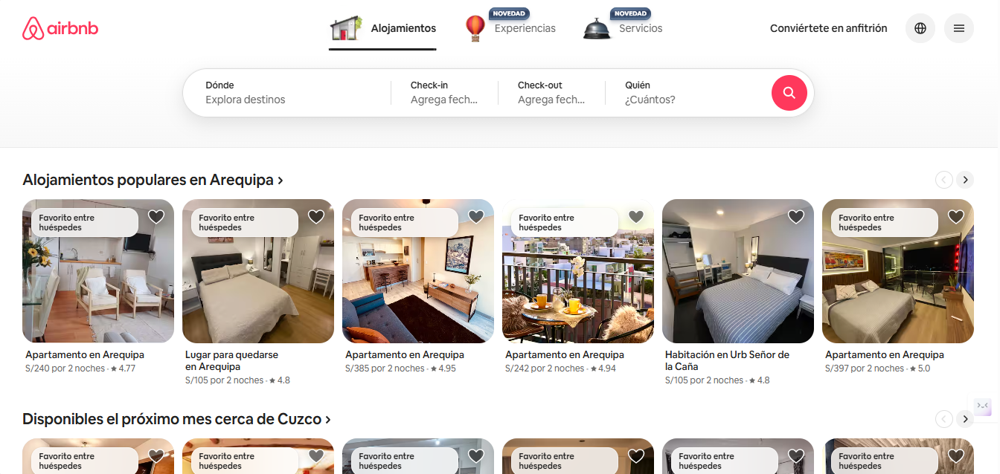

# 🌐🏠 Airbnb Clone - HTML & CSS Only 🎨

Welcome to **Airbnb Clone**, a clean and responsive front-end recreation of Airbnb’s layout — built with just **HTML5** and **CSS3**, applying the **BEM methodology** for class naming and structured using the **ITCSS architecture**.  
This project is part of a front-end development challenge for educational purposes. 🚀

## 🖼️ Preview

## 🎯 Objective

Recreate the visual structure of Airbnb's website using:

- ✅ Semantic HTML
- 🎨 Scalable CSS with ITCSS structure
- 🧱 BEM (Block Element Modifier) naming
- 📱 Mobile-first responsive design

## 🗂️ Project Structure

    airbnb-clone/
    ├── assets/
    │   └── images/                 # All static images
    ├── css/
    │   ├── main.css                # Main compiled CSS
    │   └── modules/                # ITCSS layered styles
    │       ├── settings.css
    │       ├── generic.css
    │       ├── elements.css
    │       ├── objects.css
    │       ├── components.css
    │       └── utilities.css
    ├── pages/                      # Additional HTML pages
    ├── index.html                  # Main homepage
    └── README.md

## 🔧 Technologies Used

| Language  | Description                    |
|-----------|--------------------------------|
| HTML5     | Semantic, accessible structure |
| CSS3      | ITCSS + BEM + responsive design |

## 🎨 Methodologies

| Methodology | Description |
|-------------|-------------|
| **BEM**     | *Block - Element - Modifier* para nombrar clases de forma predecible y escalable |
| **ITCSS**   | *Inverted Triangle CSS*: organiza estilos por capas desde lo más genérico a lo más específico |

## 🚀 How to Use This Project

1. **Clone the repository**

        git clone https://github.com/KathrymOriana/airbnb-clone.git 
        cd airbnb-clone

2. Open the `index.html` file in your browser.

## 📚 Useful Resources

- [🔗 BEM Naming Convention](https://getbem.com/naming/)
- [🔗 ITCSS Explained by Harry Roberts](https://www.creativebloq.com/web-design/manage-large-css-projects-itcss-101517528)
- [🔗 Responsive Design Guide – MDN](https://developer.mozilla.org/es/docs/Learn/CSS/CSS_layout/Responsive_Design)
- [🔗 HTML Reference – MDN](https://developer.mozilla.org/es/docs/Web/HTML)
- [🔗 CSS Reference – MDN](https://developer.mozilla.org/es/docs/Web/CSS)

## 📝 License

MIT License.  
This project is for educational use only.
Not affiliated with Airbnb, Inc. All logos and branding are property of their respective owners.

## 👨‍💻 Autor

Made with ❤️ by **Kathrym**.  
Academic project to practice professional HTML/CSS structure and layout.
